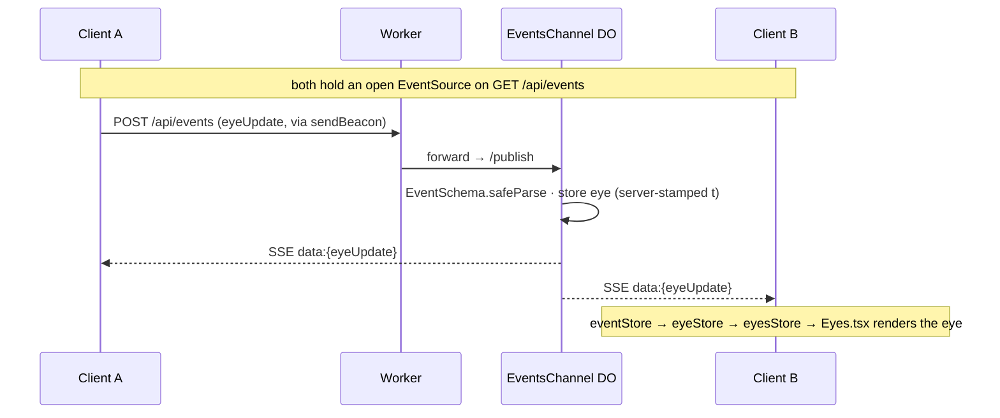

# AGENTS.md

Source-of-truth guide for working on **Planeto**. Read this first. Keep it current — if you change how something works, update the description here in the same commit.

## What this is

Planeto is a browser-based 3D toy: a procedurally generated cluster of drifting planetoids that you orbit with the camera, lightly shared between everyone connected at once. Each browser tab is an anonymous participant rendered to others as a floating "eye"; double-clicking (or a key press) fires a Unicode symbol that everyone else sees fade above your eye. Live at [planeto.tre.systems](https://planeto.tre.systems).

- **Framework:** Next.js 16 (App Router) + React 19, TypeScript (strict), built as a **static export** (`output: 'export'`).
- **Rendering:** React Three Fiber (`@react-three/fiber`) + Drei, with a Bloom pass (`@react-three/postprocessing`). Procedural textures via `simplex-noise`.
- **Physics:** Rapier (`@react-three/rapier`) rigid bodies, but gravity is **custom** — an N-body loop in `usePhysicsSimulation`, not Rapier's built-in gravity.
- **State:** Zustand (+ the `zustand/middleware/immer` middleware), five small stores.
- **Domain:** Zod guards the wire boundary (`EventSchema` in `event.ts`); client-side shapes (`planet.ts`, `eye.ts`) are plain types.
- **Multiplayer:** Server-Sent Events for server→client, HTTP POST for client→server, both at `/api/events`. The server is a Cloudflare **Durable Object** (`EventsChannel`) holding the shared state in memory — no database, no persistence.
- **Deployed:** Cloudflare Workers — a single Worker serves the static export and hosts the Durable Object, at `planeto.tre.systems`.

Size: ~2k LOC, ~30 source files, 5 Zustand stores, 1 Durable Object.

## Workflow

- Work directly on `main`; commit and push directly (no feature branches or PRs unless asked).
- Check `git status` before editing; preserve unrelated local changes.
- Stage explicit file paths, not `git add -A` / `git add .`.
- For user-visible code changes the standing flow is: commit, push, watch CI, then smoke-test the live site. Docs-only changes just need commit + push.
- Keep commit messages short and imperative.

## Commands

Node >= 22, npm.

```bash
npm run dev          # next dev --turbopack — FRONT-END ONLY; /api/events is NOT served here
npm run build        # next build → static export in ./out
npm run preview      # build, then `wrangler dev` (serves ./out + the Worker + DO) on :3000
npm run deploy       # build, then `wrangler deploy` to Cloudflare

npm run verify       # prettier --write . && eslint (--max-warnings=0) && tsc (app + worker)   (mutates: formats files)
npm run test         # vitest (watch)
npm run test:run     # vitest run (unit tests)
npm run check        # verify + test:run + playwright e2e  (full local gate)
npm run test:e2e     # playwright only (runs against `wrangler dev` via the preview server)

npm run deps         # npm-check-updates (report)
npm run nuke         # rm node_modules + lockfile + .next + out, reinstall
npm run diagrams     # render docs/diagrams/*.dot → PNG (needs Graphviz)
```

**Before committing, run `npm run verify`** (and `npm run test:run` for anything non-trivial). CI (`.github/workflows/deploy.yml`) runs `npm run verify` + `npm run test:run` + build, then `wrangler deploy`, on every push to `main`. The Playwright e2e suite runs locally (via `npm run check` or `npm run test:e2e`), not in CI.

Anything touching multiplayer needs the Worker + DO, so use `npm run preview` (or `npm run check`) — plain `next dev` has no `/api/events`.

## Architecture & code map


**Runtime data flow.** The client renders the planet cluster in an R3F `Canvas` and runs the gravity simulation locally. Multiplayer is a thin presence layer over `/api/events`:

- _Outbound — eye position:_ `useEyePositionReporting` beacons the camera position (rounded) to `POST /api/events` as an `eyeUpdate`, only when it changed, or unconditionally every 20 s, via `navigator.sendBeacon`.
- _Outbound — symbol:_ a key press (`SymbolHandler` in `page.tsx`) or Canvas double-click sets `symbolStore.lastInput`; `useInputThrottle` POSTs it as a `symbol` event, throttled to one per 100 ms.
- _Server (Worker + DO):_ the Worker forwards `/api/events` to a single global `EventsChannel` Durable Object (`idFromName("global")`), which validates every POST against `EventSchema`. `eyeUpdate` → store (server-stamped `t`) **and** fan out; `symbol` → fan out only. `GET` opens an SSE stream, registers the writer, replays the current eyes, and keepalive-pings every 20 s. Stale eyes (> 30 s) are purged lazily on each publish/subscribe.
- _Inbound:_ `eventStore` owns one `EventSource`, re-validates each frame, and fans out to listeners: `eyeUpdate` → `eyeStore` (raw) → `eyesStore` (animated) → `Eyes.tsx`; `symbol` → `symbolStore.remoteKeys` → fading text in `Eye.tsx`.

The publish → fan-out round-trip:



**Wire contract** (`/api/events`, one endpoint):

| Method | Body                                                             | Response                                                                                       |
| ------ | ---------------------------------------------------------------- | ---------------------------------------------------------------------------------------------- |
| `POST` | a `SymbolEvent` or `EyeUpdate` (validated against `EventSchema`) | `200 {ok:true}`, or `400 {error, …}` on a malformed payload                                    |
| `GET`  | —                                                                | SSE (`text/event-stream`); each frame is `data:{event}\n\n` — current eyes replayed, then live |

```
worker/
  index.ts            # Worker entry: routes /api/events to the EventsChannel DO; serves everything else from static assets (env.ASSETS); re-exports the DO class
  eventsChannel.ts    # EventsChannel Durable Object — SSE plumbing: subscribe (replay + keepalive), publish (validate + fan out). The pure transitions live in src/domain/eventsCore.ts
  tsconfig.json       # worker-only tsconfig (@cloudflare/workers-types, no DOM lib)
wrangler.toml         # Worker config: [assets] ./out, run_worker_first /api/events, EVENTS DO binding + migration, planeto.tre.systems
src/
  app/
    layout.tsx          # root layout; fonts; metadata (manifest link)
    page.tsx            # "use client" home; SymbolHandler keydown listener; renders <Scene/> + <SymbolDisplay/>
    components/
      Scene.tsx         # top-level R3F Canvas; generates myId = nanoid(6); wires every hook; Physics/Bloom/lights/OrbitControls; onDoubleClick → random symbol + disable gravity 2s
      Planet.tsx        # one planet as a Rapier RigidBody (sun = fixed, others = dynamic ball); material, atmosphere, optional ring, moons; delegates to DarkSun when isDarkSun
      DarkSun.tsx       # central body: pointLight + white core + pulsing translucent atmosphere shell
      Moon.tsx          # a moon on a circular orbit (rAF-animated)
      Eyes.tsx          # renders all remote eyes; defines the eye ShaderMaterial; syncEyes + per-frame animation; each eye lookAt the sun
      Eye.tsx           # one eye sphere + fading <Text> symbol (2 s fade)
      Symbol.tsx        # SymbolDisplay — fixed bottom-right HTML overlay of the LOCAL user's last symbol
  hooks/
    useEventSource.ts            # ensure eventStore connected; subscribe 'symbol' → symbolStore.setRemoteKey (skips own id)
    useEyes.ts                   # subscribe 'eyeUpdate' → eyeStore.setEye; prune stale; returns [id, Vec3][]
    useEyePositionReporting.ts   # beacon camera position to /api/events on change / every 20 s
    useInputThrottle.ts          # throttled (100 ms) POST of 'symbol' events from symbolStore.lastInput
    usePhysicsSimulation.ts      # rAF O(n²) gravity loop (G = 1); applyImpulse per dynamic body; honors physicsStore.isGravityDisabled
    usePlanetData.ts             # builds the sun + 19 planets once bump maps exist; exports G = 1
    index.ts                     # barrel (the 5 reporting/input hooks; not useEyes)
  stores/                        # Zustand, all wrapped in zustand/middleware/immer
    eventStore.ts                # owns the single EventSource; connect/disconnect; symbol/eye listener registries; validates inbound frames
    eyeStore.ts                  # raw remote eye positions { p, t } per id
    eyesStore.ts                 # animated "managed" eyes: appear/visible/disappear lifecycle, per-eye material, lerp + fade
    physicsStore.ts              # isGravityDisabled flag + disableGravityTemporarily(ms)
    symbolStore.ts               # lastInput (local) + remoteKeys (per id); exposes the dev-only window.__ debug handles
  domain/                        # the wire protocol (Zod, shared with the Worker) + plain domain types
    event.ts                     # Vec3 / SymbolEvent / EyeUpdate / EventSchema (discriminated union) — the validation gate; EYE_STALE_MS
    eventsCore.ts                # pure DO state transitions (applyEvent, pruneStaleEyes, encodeEventFrame) — unit-tested, shared with the Worker
    eye.ts                       # EyeState / EyeStatus + scale & fade constants (plain client-side types)
    planet.ts                    # Planet / Moon / AtmosphereLayer (plain client-side types)
    symbol.ts                    # SymbolInput + the SYMBOLS glyph list
    index.ts                     # barrel
  lib/utils.ts                   # colour / noise / texture / vector helpers (generateBumpMap, generateColorMap, roundVec3, areVec3sEqual, …)
  lib/simulationParams.ts        # SIM — centralised procedural-generation + gravity tuning constants
tests/                           # Playwright, Chromium only — run against `wrangler dev`
  api.spec.ts                    # POST /api/events contract: 400 on bad payloads, 200 on valid symbol/eyeUpdate
  basic.spec.ts                  # SSE fan-out + replay over the wire (EventSource), independent of client internals
  visual-snapshot.spec.ts        # loads /, asserts a <canvas>, writes screenshots/loaded.png
```

Unit tests are co-located next to source as `*.test.ts` (Vitest, node env): `src/lib/utils.test.ts`, `src/domain/event.test.ts`, `src/domain/symbol.test.ts`. The `tests/` folder is Playwright e2e only.

## Patterns

The codebase is assembled from a small set of repeated patterns. Reach for the matching one when extending it.

**Boundary & data**

- **Wire schema is the single source of truth.** `src/domain/event.ts` (`EventSchema`) defines the `/api/events` protocol once and is imported _verbatim_ by both the client (`eventStore`) and the Worker/DO (`eventsChannel`). Change a wire shape only here.
- **Parse at the boundary.** Every inbound network payload is `EventSchema.safeParse`d before use — the DO's POST handler and each inbound SSE frame (`eventStore._handleMessage`). Never touch an unparsed payload.
- **Shared protocol values live in `src/domain`.** Anything both sides must agree on — the wire schema, the eye-staleness window `EYE_STALE_MS` — is defined once in `src/domain/event.ts` (the worker-safe, dependency-free module) and imported by client and Worker.
- **Server-authoritative timestamp.** The DO stamps `eyeUpdate.t` with its own `Date.now()` and ignores the client's; staleness is judged by that server clock.

**Client state**

- **One Zustand store per concern** — `create<…>()(immer(...))`, state fields + action methods, all mutations through Immer (`eventStore`, `eyeStore`, `eyesStore`, `symbolStore`, `physicsStore`). Stores with rich actions split their types as `<Name>StoreState` / `<Name>StoreActions` (`eventStore`, `eyeStore`, `eyesStore`); the two simplest keep one combined type for cleaner selector typing (`symbolStore` → `SymbolState`, `physicsStore` → `PhysicsState`).
- **Raw → animated two-stage pipeline.** Network truth lands in a _raw_ store (`eyeStore`: last `{ p, t }` per id); a _managed_ store (`eyesStore`) derives the animated presentation (appear/visible/disappear lifecycle, position lerp, opacity/scale fade). Keep network truth and presentation state apart.
- **Single transport owner + pub/sub.** `eventStore` owns the one `EventSource`; features subscribe via `subscribeSymbolEvents` / `subscribeEyeUpdates`, which return unsubscribe functions. Nothing else opens a connection.
- **Dev-only debug handles.** The network-facing stores expose `window.__<store>` outside production for manual inspection.

**Realtime server**

- **One global Durable Object is "the room"** — `idFromName("global")`, in-memory `eyes` map + `writers` set, evicted when idle.
- **Replay on subscribe.** A new SSE subscriber is immediately sent every current eye, then live updates.
- **Lazy purge.** Stale eyes are dropped on access (each subscribe/publish), not by a background timer.

**Composition**

- **Hook per concern.** Each multiplayer/sim concern is one hook wiring stores ↔ effects/timers (`useEyePositionReporting`, `useInputThrottle`, `useEyes`, `useEventSource`, `usePhysicsSimulation`, `usePlanetData`).
- **Component per celestial body.** One small R3F component per body type (`Planet`, `DarkSun`, `Moon`, `Eye`, `Eyes`, `Symbol`); compose, don't grow `Scene.tsx`.
- **Throttle / beacon outbound.** Outbound traffic is rate-limited and change-detected — camera position via `navigator.sendBeacon` (`useEyePositionReporting`), symbols via a 100 ms throttle (`useInputThrottle`).
- **Pure core, unit-tested.** Pure logic is split from IO and covered by Vitest — `lib/utils`, the domain schemas, and the DO's state transitions (`src/domain/eventsCore.ts`); the SSE plumbing and client wiring are covered by the Playwright e2e against `wrangler dev`.
- **Centralised simulation tuning.** The procedural-generation and gravity knobs live in one place — `src/lib/simulationParams.ts` (`SIM`) — instead of scattered through the generator (`usePlanetData`).

### Consistency notes

No known deviations — store type-naming and shared constants are uniform. Track new code-level nits here as they arise, to align when next touching the file.

## Conventions

- **TypeScript strict.** Validate anything crossing the network with **Zod** — `EventSchema` in `src/domain/event.ts` guards the DO's POST handler and every inbound SSE frame, and is shared verbatim between the client and the Worker. Client-side shapes that never cross the network (`planet.ts`, `eye.ts`) are plain types, not schemas.
- **Prettier + ESLint flat config** (`eslint.config.mjs`); lint is zero-warnings (`--max-warnings=0`). Build artifacts (`out`, `.next`) are ignored via `.prettierignore` and ESLint `ignores`.
- The Worker (`worker/`) is type-checked separately under `worker/tsconfig.json` (Workers types, no DOM) and excluded from the root tsconfig.
- **IDs** are `nanoid(6)`, generated client-side in `Scene.tsx`.
- Keep components small and single-purpose; match the existing split (one body type per component) rather than growing `Scene.tsx`.

## Deployment

- Cloudflare Workers via `wrangler.toml`: a single Worker named `planeto` serves the static export (`[assets]` → `./out`) and hosts the `EventsChannel` Durable Object (`EVENTS` binding). Custom domain `planeto.tre.systems`. **Durable Objects require a Workers Paid plan.**
- Push to `main` triggers `.github/workflows/deploy.yml`: `npm ci` → `verify` → `test:run` → `build` → `wrangler deploy` (`cloudflare/wrangler-action`). Secrets: `CLOUDFLARE_API_TOKEN` + `CLOUDFLARE_ACCOUNT_ID`.
- Local: `npm run preview` runs the whole stack (`wrangler dev`) on `:3000`; `npm run deploy` ships it.

## Gotchas

- **Multiplayer state is one global Durable Object** (`idFromName("global")`) — a single shared room, in memory, evicted when nobody is connected. It is the only stateful piece; everything else is static. If the DO is evicted/restarted, eyes are lost — acceptable, since each client re-reports its position at least every 20 s.
- **`npm run dev` has no `/api/events`.** The realtime endpoint only exists under the Worker (`wrangler dev` / `npm run preview`). Use that for anything touching multiplayer.
- **The DO and the client share `src/domain/event.ts`.** Change the wire schema in one place; both pick it up. The Worker imports it relatively (`../src/domain/event`).
- **No service worker.** `public/manifest.json` + icons make the app installable, but there is no offline support — see Backlog.
- Gravity is hand-rolled: `<Physics gravity={[0,0,0]}>` integrates bodies, and `usePhysicsSimulation` applies the forces. Changing one without the other will look wrong.

## Backlog

Useful, none urgent (the app builds, deploys, and runs):

- **PWA offline support** — add a service worker (e.g. via `@serwist/next`) for offline use.
- **Broaden test coverage** — unit tests (Vitest) cover `lib/utils.ts` and the domain schemas; the Playwright e2e runs Chromium only (Firefox/WebKit are commented out in `playwright.config.ts`), and e2e is not run in CI.
- **Rate-limit `/api/events`** — it is a public, unauthenticated write endpoint (anyone can POST eye/symbol events). Fine for a toy, but a possible abuse/cost vector; a per-IP limiter (cf. the sibling `antenna`'s `RateLimiter` Durable Object) would harden it.
- **Visual-snapshot churn** — `tests/visual-snapshot.spec.ts` overwrites the tracked `screenshots/loaded.png` on every run; point it at a gitignored path (or make it an opt-in baseline) so e2e runs don't dirty the working tree.

Code-level pattern deviations to align when touched are tracked under [Patterns → Consistency notes](#consistency-notes).

## Docs

Docs describe the current state in the present tense; keep history in git, not in docs. This file is the source of truth; [README.md](README.md) is the public front page. The only other docs are the architecture diagrams:

- [docs/diagrams/](docs/diagrams/README.md) — the Graphviz system overview (`.dot` source + committed PNG) and how to regenerate it.
