# Planeto

[](https://github.com/rgilks/planeto/actions/workflows/fly.yml)


<div align="center">
  <a href='https://ko-fi.com/N4N31DPNUS' target='_blank'></a>
</div>

> In the void, a cluster of planetoids drifts. Disembodied eyes hover, exchanging cryptic emerald glyphs. No sun, no orbit, only the silent gaze and the endless, shifting dance of matter and symbol.

## Features

- Esoteric planetoid cluster, ever-evolving
- Disembodied eyes, each a silent watcher
- Glyphic communication: green symbols flicker between entities
- Procedural textures and shifting forms
- Arcane controls: zoom, rotate, peer deeper
- Multiplayer: your glyphs are seen by other eyes, and theirs by you
- Immutable domain, defined by Zod
- **Efficient presence:** Camera sends a lightweight ping if it hasn't moved, so your eye remains visible without unnecessary data

## The Dance of Matter

- All bodies drift, collide, and influence each other in the void
- Gravity is a hidden hand, unseen but ever-present
- Collisions are rare, but when they occur, the cluster shudders

## The Stack of Rituals

- Next.js (App Router, TypeScript)
- React Three Fiber (@react-three/fiber)
- Drei (@react-three/drei)
- Rapier physics (@react-three/rapier)
- Zod (domain model)
- Zustand (state management)

## To Enter the World

```sh
npm install
npm run dev
```

Open your portal: [http://localhost:3000](http://localhost:3000)

## The Structure of the Void

Behold the lattice of the void, where every glyph and watcher finds its place:

```mermaid
flowchart TD
    A[planeto/] --> B[src/]
    B --> C[app/]
    C --> C1[api/]
    C1 --> C11[camera/route.ts]
    C1 --> C12[events/route.ts]
    C1 --> C13[game-events/route.ts]
    C --> C2[components/]
    C2 --> C21[KeyboardDisplay.tsx]
    C2 --> C22[RemoteEyes.tsx]
    C2 --> C23[Scene3D.tsx]
    C2 --> C24[useCameraPublisher.ts]
    C2 --> C25[useRemoteCameras.ts]
    C --> C3[globals.css]
    C --> C4[favicon.ico]
    C --> C5[layout.tsx]
    C --> C6[page.tsx]
    B --> D[lib/]
    D --> D1[domain/keyboard.ts]
    D --> D2[sseStore.ts]
    D --> D3[store/keyboardStore.ts]
    A --> E[docs/]
    E --> E1[e2e-testing.md]
    E --> E2[keyboard-input.md]
    E --> E3[physics-simulation.md]
    E --> E4[sun-rendering.md]
    E --> E5[technical-overview.md]
    A --> F[public/]
    F --> F1[screenshot.png]
    F --> F2[eye.jpg]
    F --> F3[globe.svg]
    F --> F4[next.svg]
    F --> F5[vercel.svg]
    F --> F6[window.svg]
    F --> F7[file.svg]
    A --> G[screenshots/]
    G --> G1[snapshot.png]
    G --> G2[solarsystem-snapshot.png]
    A --> H[tests/]
    H --> H1[example.spec.ts]
    H --> H2[visual-snapshot.spec.ts]
    A --> I[.github/]
    A --> J[.next/]
    A --> K[node_modules/]
    A --> L[test-results/]
    A --> M[playwright-report/]
    A --> N[.gitignore]
    A --> O[eslint.config.mjs]
    A --> P[next-env.d.ts]
    A --> Q[next.config.ts]
    A --> R[package-lock.json]
    A --> S[package.json]
    A --> T[playwright.config.ts]
    A --> U[postcss.config.mjs]
    A --> V[README.md]
    A --> W[tsconfig.json]
    A --> X[tsconfig.tsbuildinfo]
```



_The void is deep. The structure is ever-shifting, but this is its current form._

## Ritual Scripts

- `npm run dev`: Open the portal
- `npm run build`: Prepare the world for others
- `npm run start`: Begin the ritual in production
- `npm run lint`: Seek out impurities
- `npm run check`: All-seeing check: format, lint, type, and test

## End-to-End Omens

- Playwright tests: `npm run test:e2e`

## Extending the Mystery

- To birth new planetoids, alter the genesis logic in `Scene3D.tsx`
- To change the glyphs, edit the `SYMBOLS` array in `src/app/components/KeyboardDisplay.tsx` and `src/app/components/RemoteEyes.tsx`

## License

MIT (for those who care for such things)

## Notes from the Void

- The gaze is fixed. There is no sun. There is no center. Only the cluster and the eyes.

## Glyphic Exchange

When a watcher presses a key, a vast green glyph (from an alien alphabet) appears in the bottom-right. This glyph is not the key, but a symbol mapped from it. Only the glyphs of other eyes are seen in the void; your own glyph is for your gaze alone. Glyphs are broadcast instantly to all who watch. Repeated key events from holding a key down are now ignored to save bandwidth.

- State: Zustand (`src/lib/store/keyboardStore.ts`)
- Schema: Zod (`src/lib/domain/keyboard.ts`)
- Ritual: `src/app/page.tsx` (captures non-repeated keydown events)
- Manifestation: `src/app/components/KeyboardDisplay.tsx` (your glyph), `src/app/components/RemoteEyes.tsx` (others' glyphs)
- To alter the glyphs or their color, change the relevant components.

---

### Efficient Real-Time Communication (Camera & Events)

This project uses Server-Sent Events (SSE) to share camera positions and game events (like keyboard inputs) in near real-time among all connected users. Significant effort has been made to minimize bandwidth and server load:

- **Camera Presence**: Your camera's position is sent to the server when you first connect and then only when it significantly changes. If your camera remains idle, its data is automatically purged from the server after a short period (currently ~4 seconds of inactivity) to keep the active user list fresh and reduce unnecessary data retention. If you move again, your camera will reappear to others.
- **Keyboard Events**: Only distinct key presses are sent to the server; repeated events from holding a key down are ignored on the client-side before transmission.
- **Server-Side Logic**: The server manages lists of active cameras and event subscribers, efficiently broadcasting updates only when necessary.

For a detailed technical explanation of the real-time architecture and bandwidth optimization strategies, please see [`docs/realtime-communication.md`](./docs/realtime-communication.md).

## Deployment on Fly.io

This application can be deployed to Fly.io using the provided `Dockerfile` and `fly.toml` configuration.

### Prerequisites

1.  Install `flyctl`: Follow the instructions at [https://fly.io/docs/hands-on/install-flyctl/](https://fly.io/docs/hands-on/install-flyctl/).
2.  Login to Fly: Run `fly auth login`.

### Initial Deployment

1.  **Launch the app on Fly.io (if you haven't already):**

    ```sh
    fly launch
    ```

    - Choose an app name (e.g., `planeto`).
    - Select your organization and a region.
    - **IMPORTANT**: Say "No" when asked to set up a Postgres database or Redis, as this application does not require them.
    - A `fly.toml` file will be generated. The provided `fly.toml` in this repository is configured for cost-effectiveness (small machine, auto-stop/start).

2.  **Deploy your application:**
    ```sh
    fly deploy
    ```

### Subsequent Deployments

After making changes to your application, simply run:

```sh
fly deploy
```

Fly.io will use the `Dockerfile` to build and deploy your updated application.

### Monitoring

- View logs: `fly logs -a <your-app-name>`
- Open your deployed app: `fly apps open -a <your-app-name>`
- Access the Fly.io dashboard for more detailed monitoring.

For more detailed deployment and configuration information, see `docs/deployment-flyio.md`.
