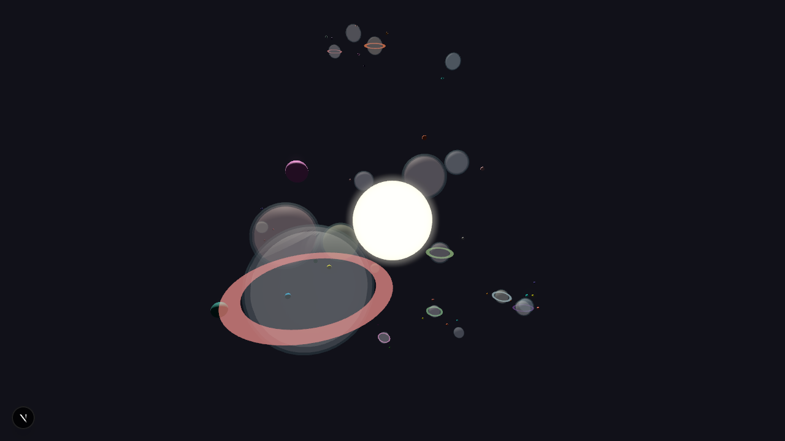
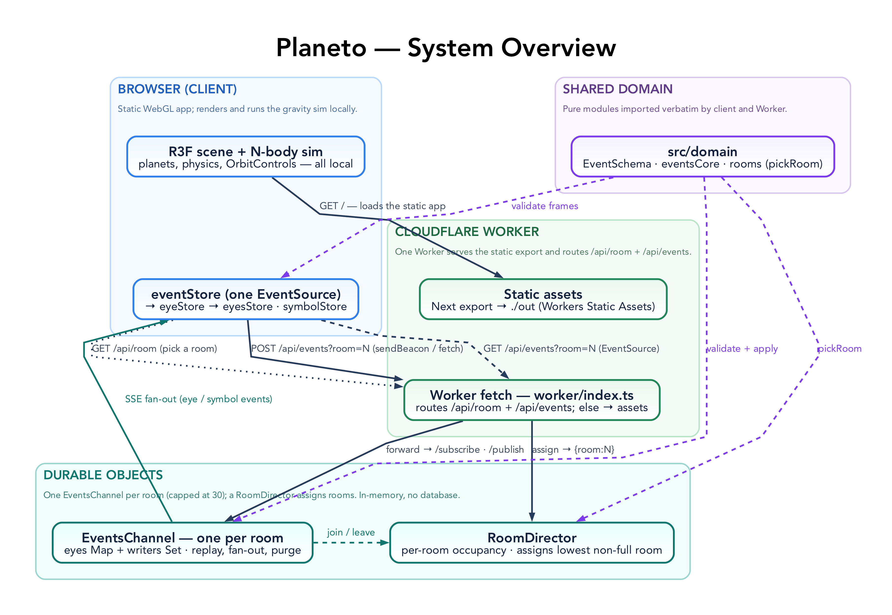

# Planeto

[](https://github.com/tre-systems/planeto/actions/workflows/deploy.yml)



<div align="center">
  <a href='https://ko-fi.com/N4N31DPNUS' target='_blank'></a>
</div>

> A browser-based 3D toy: a procedurally generated cluster of drifting planetoids you orbit with the camera, lightly shared with everyone else connected. Each tab is an anonymous "eye"; double-click or press a key to fire a Unicode symbol that everyone sees fade above your eye.

Live at **[planeto.tre.systems](https://planeto.tre.systems)**.

## Features

- Procedurally generated planetoid cluster — textures, forms, moons, and rings.
- Custom N-body gravity: bodies drift, attract, and occasionally collide.
- Lightweight multiplayer presence — other users appear as floating "eyes" you can watch move.
- Real-time symbol exchange — double-click or type to broadcast a glyph to everyone.
- Orbit controls: rotate and zoom.

## Tech stack

- Next.js (App Router, TypeScript), built as a static export
- React Three Fiber + Drei + a Bloom pass, Rapier rigid bodies
- Zustand for state, Zod for the wire protocol
- Cloudflare Workers + a Durable Object (static hosting + the realtime backend)

## Quick start

```sh
npm install
npm run dev      # front-end only, at http://localhost:3000
```

`npm run dev` does **not** serve `/api/events` (the multiplayer endpoint). To run the full stack — static export + Worker + Durable Object — locally:

```sh
npm run preview  # builds, then serves everything with `wrangler dev` on :3000
```

Common scripts (full list in [AGENTS.md](AGENTS.md)):

| Script            | What it does                               |
| ----------------- | ------------------------------------------ |
| `npm run dev`     | Next dev server (front-end only)           |
| `npm run preview` | Full stack locally via `wrangler dev`      |
| `npm run build`   | Static export into `out/`                  |
| `npm run deploy`  | Build + `wrangler deploy` to Cloudflare    |
| `npm run check`   | Format, lint, type-check, unit + e2e tests |

## Architecture



A static WebGL client served by a single Cloudflare Worker. Clients ask `GET /api/room` for the lowest non-full room (assigned by a `RoomDirector` Durable Object), then connect to `/api/events?room=N`, which the Worker routes to that room's `EventsChannel` DO - a multiplayer "room" capped at 30 connections, overflowing into fresh rooms under load. The client renders the cluster and runs gravity locally; multiplayer is a thin presence layer (Server-Sent Events down, HTTP POST up).

**[AGENTS.md](AGENTS.md) is the full guide** — architecture, code map, patterns, conventions, deployment, and the `/api/events` wire contract. Diagram sources live in [docs/diagrams/](docs/diagrams/README.md).

## Customisation

- Planet generation and gravity tuning: `src/lib/simulationParams.ts` (the `SIM` config) and `src/hooks/usePlanetData.ts`.
- The symbol set: the `SYMBOLS` array in `src/domain/symbol.ts`.

## Deployment

Pushes to `main` build and deploy automatically via `.github/workflows/deploy.yml` (Cloudflare). Durable Objects require a Workers **Paid** plan; see [AGENTS.md → Deployment](AGENTS.md#deployment) for details and secrets.

The app ships a web app manifest (`public/manifest.json`) so it can be installed to a home screen; there is no service worker or offline support.

## License

MIT
