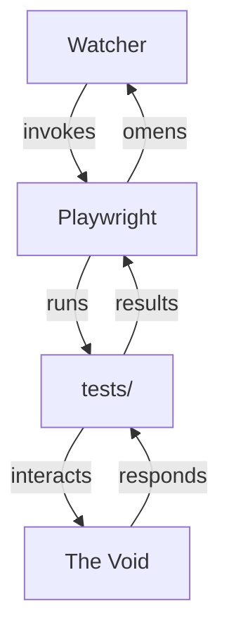

# End-to-End Omens

> The watcher must be vigilant. Rituals are performed to ensure the void remains unbroken. Omens are read in the glyphs and the cluster's dance.

## The Ritual

- Playwright is the oracle, revealing what the watcher sees.
- Ritual scripts are found in `tests/`.
- The portal is opened, the omens are read, and the void is checked for corruption.

## The Flow of Omens

## Ritual Scripts

- `npm run test:e2e`: Invoke all omens.
- `npm run test:e2e:watch`: Watch the void for changes, omens appear as they arise.

## Reading the Omens

- The HTML report (`npx playwright show-report`) reveals visions.
- The JSON report is for those who read the glyphs in code.

## Future Omens

- Visual regression: to see if the void has shifted.
- CI integration: to ensure the void is always watched.
