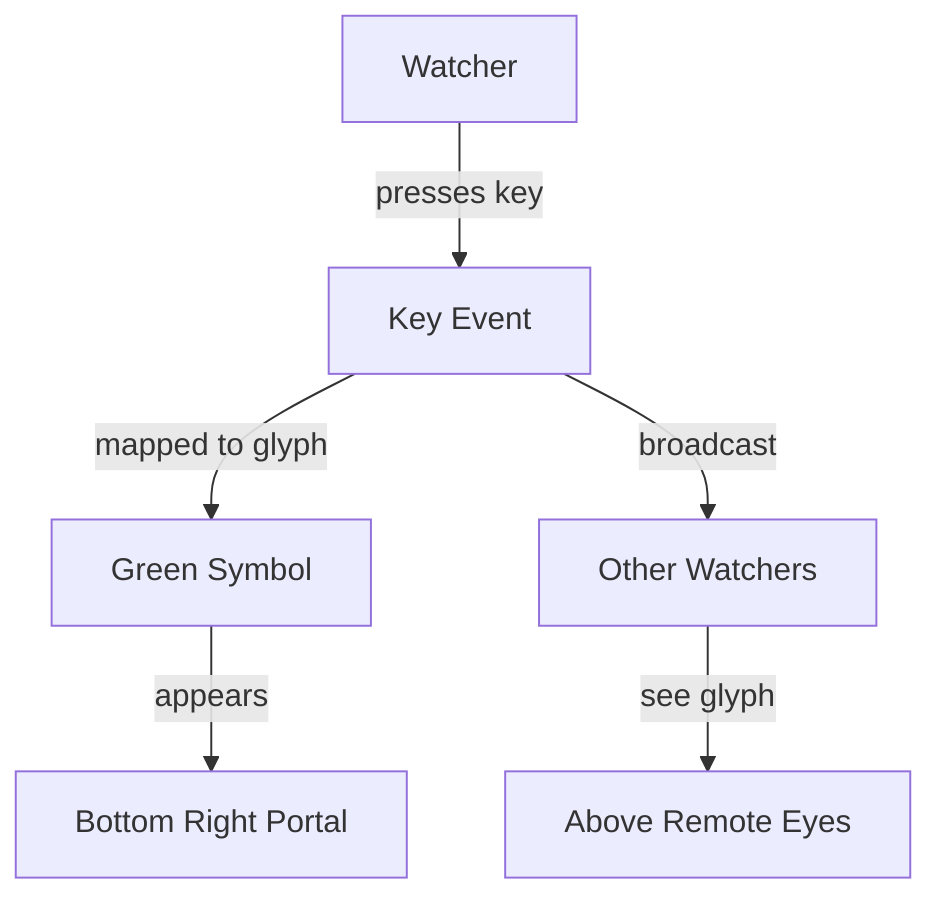

# Glyphic Exchange

> The watcher presses a key. A glyph is conjured, emerald and strange. It appears in the portal, and is seen by all other eyes in the void.

## The Ritual of Glyphs

- When a watcher presses a key, it is mapped to a symbol from an alien alphabet.
- The glyph appears in the bottom-right portal, vast and green.
- Only the glyphs of other eyes are seen in the void; your own glyph is for your gaze alone.
- Glyphs are broadcast instantly to all who watch.

## The Flow of Glyphs

## The Runes

- State: Zustand (`src/lib/store/keyboardStore.ts`)
- Schema: Zod (`src/lib/domain/keyboard.ts`)
- Ritual: `src/app/page.tsx`
- Manifestation: `src/app/components/KeyboardDisplay.tsx` (your glyph), `src/app/components/RemoteEyes.tsx` (others' glyphs)
- To alter the glyphs or their color, change the relevant components.
