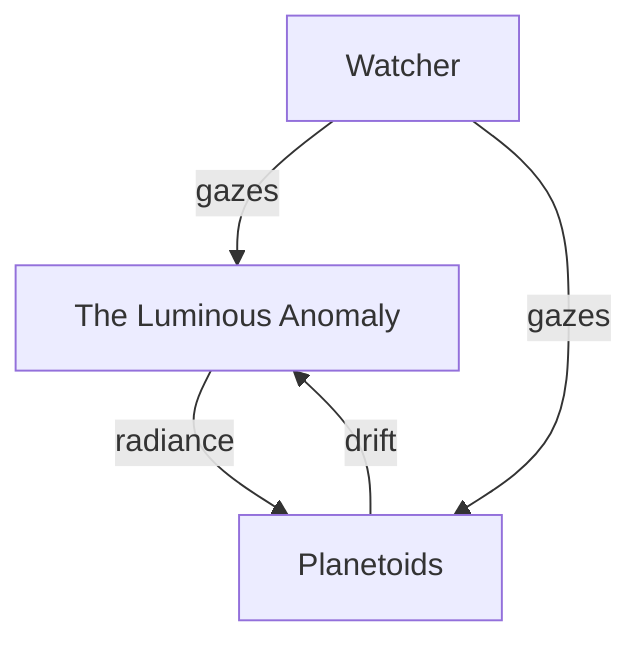

# The Luminous Anomaly

> In the heart of the void, a sphere burns. It is not a sun, but a beacon. The planetoids drift around it, bathed in its shifting light.

## The Anomaly's Place

## The Rendering

- The anomaly is conjured as a bright sphere in `Scene3D.tsx`.
- Its color, size, and glow are set in the genesis logic.
- To alter its appearance, change the relevant lines in `Scene3D.tsx`.
