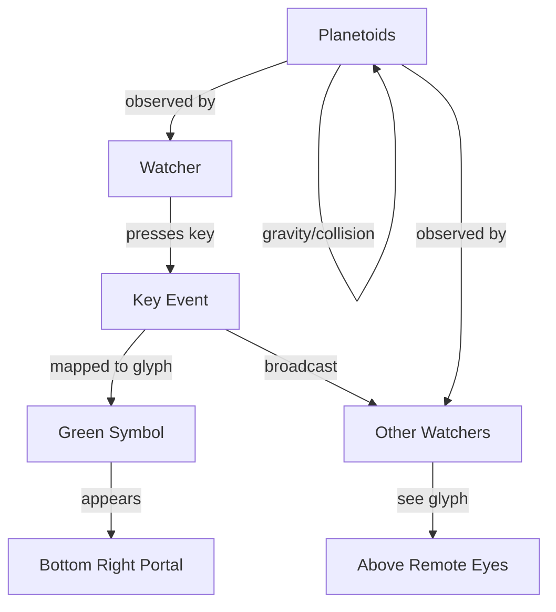

# Planeto - Technical Overview

> In the endless void, clusters of matter drift, watched by silent eyes. Glyphs flicker in the darkness, exchanged in patterns only the initiated may decipher.

## Principles of the Void

- **Immutable Domain:** Zod shapes the essence of all things.
- **Component-Based Vision:** React Three Fiber conjures the cluster and the eyes.
- **Gravity's Whisper:** Rapier physics moves the matter, unseen but inexorable.
- **Type Safety:** TypeScript and Zod bind the world in unbreakable runes.
- **Glyphic Broadcast:** Symbols leap from watcher to watcher, instant and cryptic.

## The Architecture of the Cluster

## Core Components

- **Scene3D.tsx:**
  - The locus of the cluster, where matter and eyes are rendered and moved.
  - Glyphic events are visualized and broadcast.
- **RemoteEyes.tsx:**
  - Renders the eyes of other watchers and their glyphs.
- **KeyboardDisplay.tsx:**
  - Shows your glyph in the portal.
- **page.tsx:**
  - The watcher's entry point and glyph handler.

## Data Flow

- **Genesis:**
  - Planetoids are born and given mass, color, and motion in `Scene3D.tsx`.
- **Gravity:**
  - Every planetoid whispers to every other, pulling and colliding.
- **Glyphs:**
  - Key events are mapped to symbols, shown to the watcher, and broadcast to all others.

## Extending the Void

- To birth new planetoids, alter the genesis in `Scene3D.tsx`.
- To change the glyphs, edit the `SYMBOLS` array in the glyph components.

## Libraries of the Void

- React Three Fiber
- Drei
- Rapier physics
- Zod
- Zustand
- TypeScript

## Camera Logic

The camera is fixed in position and does not follow any object. The view remains static, providing a consistent perspective of the planetary system.

---

## Camera Presence and Heartbeat

To keep your eye visible to others, the app now sends a minimal heartbeat (just your id) every 2 seconds if your camera hasn't moved. This avoids unnecessary network traffic and ensures your presence is maintained efficiently. If you move your camera, the full position is sent as before. The backend updates your timestamp on ping, so your eye is not removed from the cluster unless you close the browser or lose connection for an extended period.
